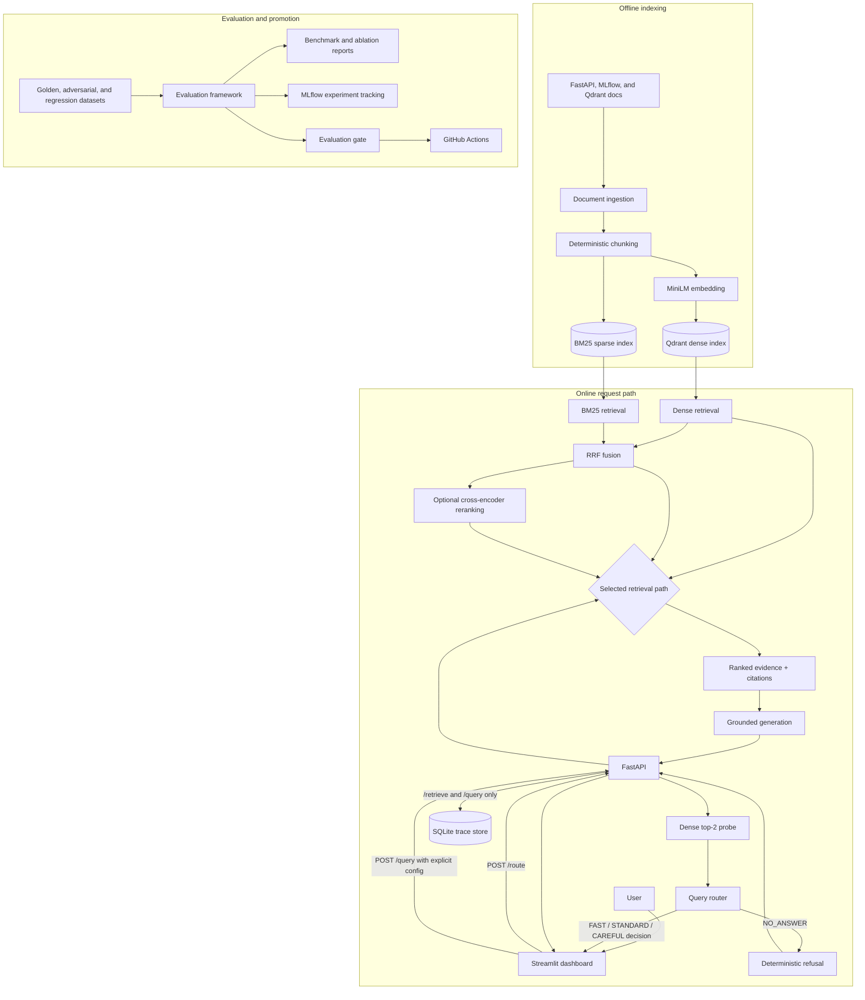

# RAGOps Control Plane

## Evaluation-gated, cost-aware RAG over technical documentation

[](https://github.com/NeguseNegest/Ragops-Control-Plane/actions/workflows/ci.yml)
[](https://www.python.org/)
[](https://fastapi.tiangolo.com/)
[](https://qdrant.tech/)
[](https://streamlit.io/)
[](https://mlflow.org/)
[](https://docs.docker.com/compose/)
[](LICENSE)

I built RAGOps Control Plane to compare, route, observe, and gate retrieval-augmented generation pipelines with evidence instead of gut feeling.

## Table of contents

- [Architecture](#architecture)
- [Why I built this](#why-i-built-this)
- [What I built](#what-i-built)
- [Measured results](#measured-results)
- [Example query](#example-query)
- [Evaluation methodology](#evaluation-methodology)
- [Routing strategy](#routing-strategy)
- [Observability](#observability)
- [CI and evaluation gate](#ci-and-evaluation-gate)
- [Quickstart](#quickstart)
- [Repository structure](#repository-structure)
- [Limitations](#limitations)
- [Future work](#future-work)
- [Further documentation](#further-documentation)
- [License](#license)

## Architecture



There is one detail in that diagram I want to be explicit about: the dashboard calls `/route`, receives a decision, and then calls `/query` with the selected config. The current `/query` endpoint does **not** silently dispatch FAST, STANDARD, or CAREFUL on its own. I kept that boundary visible because pretending the router is enforced server-side would be misleading.

The longer version, including the offline data flow, registry boundary, trace schema, and error paths, is in [docs/architecture.md](docs/architecture.md).

## Why I built this

Most RAG demos end as soon as a plausible answer appears on screen. That is the fun part, but it dodges the questions I actually care about: Did retrieval improve? What did the extra reranker latency buy me? When should I refuse? How much did generation cost? Can I reproduce the result, and can CI stop a bad change?

I used public FastAPI, MLflow, and Qdrant documentation as a realistic technical corpus and built the boring-but-important control-plane pieces around it. The result is deliberately more than a chat UI. It is a small RAG lab where I can compare fixed pipelines, inspect a routed decision, replay evaluations, trace a request end to end, and make promotion criteria executable.

## What I built

- **Reproducible ingestion and indexing.** The loaders handle Markdown, MDX, RST, text, HTML, and selected Python files. Chunk IDs are deterministic UUID5 values, content is hashed, embeddings are batched, dense vectors go to Qdrant, and the BM25 index is portable and provenance-checked.
- **Four retrieval paths behind one interface.** I can run dense, BM25, dense+BM25 with Reciprocal Rank Fusion, or the fused candidate set through a cross-encoder. The same query contract and timing sink are used throughout.
- **Grounded answer generation.** The API supports an offline template plus OpenAI and Gemini providers. Answers carry deduplicated citations, provider-reported or explicitly estimated token usage, and honest zero-cost/unavailable states when billing evidence is missing.
- **Explainable routing and refusal.** A versioned rule router chooses FAST, STANDARD, CAREFUL, or NO_ANSWER from a dense probe, score gap, query length, and lexical-complexity features. Every decision includes a stable reason code.
- **Evaluation as a first-class subsystem.** Retrieval quality, judged answer quality, refusal behavior, latency, and projected generation cost are all measured. Reports, ablations, failure cases, regression cases, and MLflow runs are checked for provenance instead of being loose notebook output.
- **Operational evidence.** FastAPI returns a trace ID and component timings. SQLite stores successful and failed requests, ranked chunks, pipeline route/config provenance, cost data, and partial timings. Streamlit exposes both the query experience and the engineering view.
- **A real gate, not a green checkbox.** GitHub Actions runs lint, hermetic unit and API suites, an evaluation smoke test, and a deterministic nine-threshold evaluation gate without Docker, model downloads, external APIs, or paid calls.

## Measured results

This is the final five-way benchmark in [`final_benchmark@1.0.0`](reports/evaluations/final_benchmark.json). Retrieval metrics use 50 reviewed supported questions at a common top-five depth. Answer-quality scores are cross-provider judge means over the same fixed 10 supported questions per pipeline. Fixed-pipeline latency is retrieval-only wall-clock time; routed latency is documented serial artifact composition, and both include cold-start measurements. Cost is a controlled generation-token projection, not an invoice.

| Pipeline | Recall@5 | MRR@5 | Faithfulness / 5 | p95 latency | Est. cost/query | How I treat it |
| --- | ---: | ---: | ---: | ---: | ---: | --- |
| Dense | 50.7% | 40.6% | 5.00 | 226.0 ms | $0.00006713 | Online baseline; FAST/STANDARD path |
| BM25 | 77.7% | 57.4% | 5.00 | **93.0 ms** | $0.00008321 | Strong lexical baseline |
| Hybrid (unweighted RRF) | 72.7% | 58.2% | 4.80 | 272.6 ms | $0.00007965 | Rejected comparison candidate |
| Hybrid + reranker | **81.0%** | **64.7%** | **5.00** | 7,669.2 ms | $0.00008394 | Quality candidate; CAREFUL path |
| Routed | 66.0% | 53.1% | **5.00** | 7,821.4 ms | **$0.00007603** | Draft policy study, not production |

Answer relevance was 4.30, 4.50, 4.30, 4.50, and 4.60 respectively. The routed policy correctly refused 25 of 30 reviewed unsupported/adversarial questions (83.3%), but it also sent 7 of the 50 supported benchmark questions to NO_ANSWER. That false-refusal behavior is why I call the router a draft even though it saves projected generation cost versus always reranking.

My main takeaway is not “hybrid always wins.” It does not. Plain BM25 beats unweighted RRF on Recall@5 here, while the cross-encoder produces the best ranking quality at a very obvious latency cost. That is exactly the kind of trade-off I wanted this project to surface. The complete numbers, ablations, and per-question wins/regressions are in the [final benchmark report](reports/final_benchmark.md), with the evidence-backed misses in the [failure analysis](reports/failures/failure_analysis.md).

## Example query

I asked the running dashboard:

> how do i create a fastapi

Here is what the system actually did in that live run:

| Field | Observed value |
| --- | --- |
| Route | `CAREFUL` |
| Reason | Top-two dense score gap `0.0297977` was below the `0.03` threshold |
| Pipeline | `hybrid_rrf_cross_encoder@1.0.0` |
| Returned evidence | 5 chunks |
| Generator | `gemini/gemini-3.6-flash` |
| Total latency | 13,799.6 ms |
| Generation latency | 12,541.9 ms |
| Estimated cost | $0.00178200 from provider-reported tokens |

The shortened answer was:

> Step 1 is to import FastAPI, which provides the API functionality. The Full Stack FastAPI Template is another way to start with setup, security, a database, and pre-made endpoints. The retrieved context did not contain a complete application example. [2] [3]

I like this example because it shows both sides of the system. Retrieval found relevant first-steps material and the answer stayed inside that evidence, but generation dominated the latency and the retrieved set still did not contain a clean minimal code example. The live value above is one request—not a benchmark average—and its cost should not be compared directly with the controlled projections in the benchmark table.

## Evaluation methodology

I keep the evaluation inputs and claims separate so I can tell what was actually measured:

1. **Dataset.** The reviewed snapshot has 100 golden questions, 50 retrieval-labeled supported questions, and 30 adversarial or unsupported questions. The historical inputs remain immutable; promoted failure cases live in a separate regression set.
2. **Retrieval.** Every fixed pipeline is scored on the same 50 labels at top five. I report Recall@5 and MRR@5, retain per-question rankings, and run paired ablations instead of comparing unrelated aggregate runs.
3. **Answer quality.** OpenAI `gpt-5-nano` generated answers for 10 fixed supported questions per pipeline and Gemini `gemini-3.6-flash` judged faithfulness and answer relevance on strict 1–5 rubrics. This is useful directional evidence, not human ground truth.
4. **Refusal.** The routed policy is evaluated across all 30 unsupported/adversarial questions. Fixed retrieval pipelines show refusal as not applicable because they do not own the router policy.
5. **Latency and cost.** Retrieval latency is measured locally and includes cold starts. Routed latency is composed from recorded serial artifacts. Generation cost is projected from the exact prompt/reference-answer pairs and the versioned model-price table; local compute, infrastructure, caching, and judge calls are excluded.
6. **Failure analysis.** I manually reviewed 15 deterministic cases across nine failure categories. Fourteen evidence-guarded cases were promoted to regression data; one machine-dependent latency outlier stayed analysis-only.

The exact schemas, commands, review rules, and interpretation limits are documented in [docs/evaluation.md](docs/evaluation.md).

## Routing strategy

The router is `rule_router@0.2.0`, currently marked `draft`. It first runs a dense top-two probe and evaluates rules in this order: NO_ANSWER, CAREFUL, FAST, then STANDARD as the fallback.

| Route | Intent | Selected behavior | Final depth |
| --- | --- | --- | ---: |
| FAST | High-confidence, simple query | Dense top two; probe reuse is policy intent but not implemented by the dashboard | 2 |
| STANDARD | Normal supported query | Dense retrieval | Up to 10 |
| CAREFUL | Ambiguous, complex, or small score gap | Hybrid RRF + cross-encoder | Up to 5 |
| NO_ANSWER | Empty or low-confidence evidence | Deterministic refusal; no LLM call | 0 |

The policy is explainable by construction: the response includes the selected route, primary reason, every matched reason code, probe scores, query features, config, and depth cap. The current no-answer threshold is intentionally safety-first and still too aggressive. Because the dashboard makes a second explicit `/query` call, FAST currently repeats dense retrieval instead of reusing the probe. See [docs/routing.md](docs/routing.md) and [docs/no_answer.md](docs/no_answer.md) for the full contract.

## Observability

Each endpoint returns inspectable execution evidence. Accepted `/retrieve` and `/query` calls are persisted; `/route` is intentionally decision-only and untraced. For generated queries, the API returns and persists:

- a UUID trace ID in both the body and `X-Trace-ID` header;
- pipeline name, version, status, route, and selected config;
- ordered chunks, scores, citations, and used chunk IDs;
- embedding, dense, BM25, fusion, reranker, and generation timings when those components run;
- provider, model, token source, rate source, and generation-cost status; and
- partial timings plus a sanitized public error when execution fails.

SQLite is the local request-trace store, while MLflow holds evaluation runs, metrics, parameters, artifacts, and verified run references. The dashboard's Query Playground shows one request in detail; its Engineering tab shows the final benchmark, quality/latency trade-off, route distribution, cost and refusal summaries, recent traces, and the reviewed failures.

The details are in [docs/tracing.md](docs/tracing.md), [docs/cost_estimation.md](docs/cost_estimation.md), and [docs/pipeline_registry.md](docs/pipeline_registry.md).

## CI and evaluation gate

I split CI into five independent GitHub Actions jobs so a retrieval regression does not hide behind a generic test result:

1. Ruff linting;
2. the hermetic unit suite;
3. the offline API/control-plane suite;
4. the evaluation-gate smoke suite; and
5. the live compact evaluation gate.

The gate uses a checked-in four-document corpus, deterministic three-dimensional embeddings, in-memory Qdrant, the offline template generator, and five supported/unsupported cases. It enforces nine thresholds covering Recall@k, regression versus baseline, MRR, answer presence, citation coverage, citation precision, refusal correctness, p95 latency, and error count. It makes no external provider calls and needs no Docker service.

Run the same decision locally with:

```bash
make eval-gate
```

This compact gate is a fast regression guard, not a substitute for the 50-question final benchmark. The full CI contract and its deliberate exclusions are in [docs/ci.md](docs/ci.md).

## Quickstart

### 1. Verify the control plane offline

Python 3.11 and 3.12 are supported; I use Python 3.12. This path exercises the code and evaluation gate without Docker, model downloads, a corpus, or API keys.

```bash
cp .env.example .env
make setup
make lint
make test
make eval-gate
```

### 2. Run the full local stack

The raw documentation and generated indexes are intentionally not committed. The source fetcher checks out all three corpora at the commits in [`source_manifest.json`](data/manifests/source_manifest.json).

```bash
make fetch-sources
docker compose up -d --build
make ingest-dry-run
make ingest
make build-index
make evaluate
make dashboard
```

The default local endpoints are:

| Service | URL |
| --- | --- |
| Streamlit dashboard | http://127.0.0.1:8501 |
| FastAPI OpenAPI UI | http://127.0.0.1:8000/docs |
| MLflow | http://127.0.0.1:5000 |
| Qdrant | http://127.0.0.1:6333/dashboard |

The checked-in default uses `template/local-template-v1`, so it is safe for offline development but returns a placeholder answer. For real answers, set one provider and key in `.env`, then recreate the API container:

```dotenv
RAGOPS_LLM_PROVIDER=gemini
GEMINI_API_KEY=your-key
GEMINI_MODEL=gemini-3.6-flash
```

```bash
docker compose up -d --build --force-recreate api
```

`openai` with `OPENAI_API_KEY` is supported as well. I never commit provider keys, and the public cost fields remain estimates rather than billing records. See [docs/api.md](docs/api.md) for request/response examples and failure semantics.

The complete clean-setup, environment, MLflow, trace, and troubleshooting commands are in [docs/operations.md](docs/operations.md).

## Repository structure

```text
.
├── src/ragops/          # ingestion, retrieval, routing, generation, tracing, and evaluation
├── dashboard/           # Streamlit Query Playground and Engineering view
├── configs/             # versioned pipeline, router, cost, evaluation, and gate contracts
├── data/
│   ├── eval/            # reviewed golden, adversarial, label, and regression snapshots
│   ├── manifests/       # pinned corpus provenance
│   ├── raw/             # local third-party source snapshots; ignored
│   ├── processed/       # local chunks and BM25 artifact; ignored
│   └── traces/          # local SQLite request traces; ignored
├── scripts/             # reproducible indexing, evaluation, routing, and audit CLIs
├── reports/             # checked-in benchmark, ablation, MLflow, and failure evidence
├── docs/                # detailed contracts and design notes
├── tests/               # unit, API, integration, evaluation, and dashboard coverage
└── .github/workflows/   # five-job CI and evaluation gate
```

## Limitations

- Routing is client-orchestrated. `/route` returns the decision and enforces NO_ANSWER, but direct `/query` callers can bypass the router and choose a non-refusal config.
- The draft router falsely refused 7 of 50 supported final-benchmark questions. It needs more calibration before I would call it production-ready.
- Cross-encoder reranking gives the best Recall@5 and MRR@5, but its 7.67-second p95 retrieval latency is too slow for a default interactive path on this hardware.
- The final semantic evaluation has 10 supported answers per pipeline and uses an LLM judge. It is not a large or human-adjudicated answer-quality study.
- Generation cost covers token charges only. It excludes local embedding/reranking compute, infrastructure, caching, judge calls, taxes, credits, and provider-specific pricing details.
- SQLite and the in-process model/index caches are appropriate for this local control plane, not a horizontally scaled deployment. Authentication, rate limiting, distributed tracing, backups, and multi-worker cache coordination are outside the current boundary.
- The public repository does not redistribute the raw documentation corpus or generated dense/BM25 indexes. A clean environment has to recreate them from the pinned manifest.

I keep the fuller list, including what each benchmark does and does not prove, in [docs/limitations.md](docs/limitations.md).

## Future work

The next engineering moves I would make are fairly concrete:

- move route execution into the backend so refusal and pipeline selection cannot be bypassed;
- recalibrate the router on a larger human-reviewed supported/unsupported set and add an explicit false-refusal budget;
- shrink reranker latency with a smaller model, batching, candidate pruning, or a stricter selective-routing policy;
- add a larger human-adjudicated answer-quality set and compare it with the LLM judge;
- replace local-only traces with authenticated, retention-aware operational storage and distributed telemetry; and
- add canary/shadow evaluation before changing the production pipeline alias.

I am intentionally leaving semantic caching, a large monitoring stack, and automated online promotion out until the routing and evaluation evidence are strong enough to justify them.

## Further documentation

| Topic | Document |
| --- | --- |
| System boundaries and data flow | [Architecture](docs/architecture.md) |
| API request, response, and error contracts | [API](docs/api.md) |
| Evaluation datasets, metrics, and reproduction | [Evaluation](docs/evaluation.md) |
| Router rules and calibration | [Routing](docs/routing.md) |
| Deterministic refusal behavior | [No-answer policy](docs/no_answer.md) |
| Trace schema and timing semantics | [Tracing](docs/tracing.md) |
| Token and price provenance | [Cost estimation](docs/cost_estimation.md) |
| Pipeline lifecycle and aliases | [Pipeline registry](docs/pipeline_registry.md) |
| CI jobs and evaluation gate | [CI](docs/ci.md) |
| Clean setup and runtime operations | [Operations](docs/operations.md) |
| Honest system limits | [Limitations](docs/limitations.md) |

## License

Apache-2.0. See [LICENSE](LICENSE).
