# Architecture

## Current Scope

RAGOps Control Plane currently provides selectable dense, RRF hybrid, and cross-encoder-reranked RAG query paths plus standalone BM25 retrieval over local FastAPI, MLflow, and Qdrant documentation. Its implemented workflows are:

- An offline workflow that cleans and chunks documentation, then builds both a dense Qdrant index and a portable BM25 index.
- An online workflow that explicitly selects one of three validated configs, retrieves chunks, builds citations, calls the selected template, OpenAI, or Gemini generation client, and exposes the result through FastAPI. Streamlit currently uses the default dense selection.
- An offline evaluation workflow that generates and reviews QA data, validates retrieval relevance labels, compares dense, persisted BM25, and live RRF hybrid rankings, and applies cross-provider LLM judging to generated answers.
- Offline hybrid and reranked CLIs that retrieve independent dense and BM25 candidate pools, fuse ranks without normalizing incompatible raw scores, and optionally apply a cross-encoder.
- A deterministic pipeline-registry workflow that binds versioned configs to validated evaluation evidence and guarded baseline/candidate/production aliases.
- An online observability workflow that measures request components with a monotonic trace context and atomically stores each accepted retrieval/query attempt, its stage latencies, and its ranked evidence in SQLite, with a related feedback model for later UI/API integration.
- A production query contract that returns route/config provenance, trace IDs, debug diagnostics, citations/evidence, timing, provider usage, and an honest generation-cost state.
- An offline API reliability workflow that exercises the production FastAPI composition against a checked-in small corpus, in-memory Qdrant, deterministic embeddings, and temporary SQLite in GitHub Actions.
- A live integration-review workflow that evaluates all verified dense questions through HTTP, requires offline/API ranking parity, cross-checks response traces in SQLite, and verifies the complete retrieval evidence suite in MLflow.
- A validated draft router-design workflow that binds ordered FAST/STANDARD/CAREFUL/NO_ANSWER thresholds to versioned feature inputs, calibration evidence, execution intent, and eligible pipeline lifecycle states.
- A routing workflow that performs the configured dense probe (currently top two), emits schema-versioned confidence/query features, deterministically selects FAST/STANDARD/CAREFUL/NO_ANSWER with stable reasons, and exposes a decision-only `/route` endpoint.

Dense, BM25, RRF hybrid, and cross-encoder retrieval evaluation, the Day 20 LLM-as-judge acceptance workflow, the Day 21 benchmark report, the Day 28 common-interface refactor, Day 29 MLflow retrieval tracking, the Day 30 pipeline registry, the Day 31 SQLite trace store, the Day 32 trace timing context, the Day 33 production query endpoint, the Day 34 API CI suite, the Day 35 full integration review, the Day 36 router design, the Day 37 initial retrieval probe, and the Day 38 deterministic selector are implemented. Automatically executing decisions, refusal behavior, caching, canary gates, failure mining, monitoring, evaluation gates, and persisted cost accounting remain planned.

## System Diagram

```mermaid
flowchart LR
    subgraph Offline[Offline ingestion and indexing]
        Raw["data/raw\nFastAPI, MLflow, Qdrant"] --> Load[Load and clean]
        Load --> Chunk[Deterministic chunking]
        Chunk --> Embed[MiniLM embeddings]
        Embed --> JSONL["data/processed/chunks.jsonl"]
        JSONL --> Index[Qdrant index builder]
        Index --> Qdrant[(Qdrant rag_chunks)]
        JSONL --> BM25Build[Technical tokenizer and BM25 builder]
        BM25Build --> BM25Index[(bm25_index.json.gz)]
    end

    subgraph Online[Online query path]
        User[Browser user] --> Streamlit[Streamlit :8501]
        Streamlit -->|"POST /query"| API[FastAPI :8000]
        API --> ConfigSelect[Select dense / hybrid / reranked config]
        ConfigSelect --> QueryEmbed[Embed query]
        QueryEmbed -->|Cosine search| Qdrant
        ConfigSelect -->|hybrid / reranked| BM25Index
        Qdrant --> OnlineFusion[Optional RRF]
        BM25Index --> OnlineFusion
        OnlineFusion --> OnlineRerank[Optional cross-encoder]
        OnlineRerank --> Retrieved[Ranked chunks]
        Retrieved --> Citations[Citations and prompt]
        Citations --> Generator["Configured generator\ntemplate / OpenAI / Gemini"]
        Generator --> API
        API -->|"atomic trace + component timings"| TraceDB[(SQLite trace store)]
        API -->|"JSON + trace / route / cost / timings"| Streamlit
    end

    subgraph RoutingProbe[Day 36-38 decision path]
        RouterConfig["routed.yaml\nDay 36 draft policy"] --> ProbeDense
        ProbeQuery[Query] --> Lexical[Length + lexical features]
        ProbeQuery --> ProbeDense[Dense top 2]
        ProbeDense --> Confidence[Top score + score gap]
        Lexical --> RouterFeatures[InitialRetrievalFeatures v1]
        Confidence --> RouterFeatures
        RouterConfig --> Router[Deterministic rule evaluator]
        RouterFeatures --> Router
        Router --> RouteDecision[Route + reasons + execution intent]
        RouteDecision -->|"POST /route; no dispatch"| API
    end

    subgraph Hybrid[Offline hybrid CLI]
        HybridConfig[hybrid.yaml] --> HybridCLI[Hybrid query CLI]
        HybridCLI -->|"dense top 20"| Qdrant
        HybridCLI -->|"BM25 top 20"| BM25Index
        Qdrant --> RRF[Reciprocal Rank Fusion]
        BM25Index --> RRF
        RRF --> HybridTop10[Deduplicated top 10]
    end

    subgraph Evaluation[Offline retrieval evaluation]
        Golden[golden_qa.jsonl] --> Labels[retrieval_labels.jsonl]
        DenseConfig[dense_baseline.yaml] --> DenseRunner[Dense runner]
        BM25Config[bm25_baseline.yaml] --> BM25Runner[BM25 runner]
        HybridConfig --> HybridRunner[Hybrid evaluator]
        Labels --> DenseRunner
        Labels --> BM25Runner
        Labels --> HybridRunner
        DenseRunner -->|"45 dense queries"| Qdrant
        BM25Index --> BM25Runner
        Qdrant --> HybridRunner
        BM25Index --> HybridRunner
        DenseRunner --> Metrics["Recall / MRR / Hit Rate / nDCG"]
        BM25Runner --> Metrics
        HybridRunner --> Metrics
        Metrics --> Reports["JSON + CSV reports"]
        Reports --> Paired["Three-way ranks + cohorts + failures"]
        Paired --> Comparison["Comparison JSON + Markdown"]
        Reports --> MLflow[(MLflow retrieval experiment)]
        Comparison --> MLflow
        Labels --> APIEval[Live API evaluator]
        APIEval -->|"45 POST /query requests"| API
        APIEval -->|"exact ranking parity"| Reports
        APIEval -->|"trace verification"| TraceDB
        APIEval -->|"evidence verification"| MLflow
    end

    subgraph Registry[Pipeline registry]
        VersionedConfigs["Versioned retrieval YAMLs"] --> RegistryBuilder[Registry builder and validator]
        Comparison --> RegistryBuilder
        MLflowCatalog["configs/mlflow.yaml"] --> RegistryBuilder
        RegistryBuilder --> RegistryJSON["reports/pipeline_registry.json"]
        RegistryJSON --> Aliases["baseline / candidate / production"]
    end

    subgraph GenerationEvaluation[Offline generation evaluation]
        JudgeConfig[generation_judge.yaml] --> Sample["10-question stratified sample"]
        Golden --> Sample
        Sample -->|"retrieve top 5"| Qdrant
        Qdrant --> EvalGenerator[OpenAI generator]
        EvalGenerator --> EvalJudge[Gemini judge]
        EvalJudge --> JudgeReports["Judgments JSONL + summary JSON"]
        JudgeReports --> SpotCheck[Manual spot-check]
    end
```



## Component Responsibilities

| Component | Location | Responsibility |
| --- | --- | --- |
| Loaders and cleaners | `src/ragops/ingestion` | Read supported local files, normalize text, and retain source provenance. |
| Chunker | `src/ragops/ingestion/chunking.py` | Create deterministic fixed, overlapping, or heading-aware chunks with UUID5 IDs and SHA256 hashes. |
| Embedder | `src/ragops/ingestion/embeddings.py` | Generate batched `sentence-transformers/all-MiniLM-L6-v2` vectors and cache the model in-process. |
| Indexer | `src/ragops/indexing/qdrant.py` | Create the `rag_chunks` collection and upsert embedded chunk records with payload metadata. |
| Retriever contract and factory | `src/ragops/retrieval/base.py`, `factory.py` | Provide the shared `retrieve(query, top_k, timings)` interface, validate the configured interface version, and construct any retrieval pipeline from its validated config and runtime resources. |
| Dense retriever | `src/ragops/retrieval/dense.py` | Embed a query, search Qdrant, and normalize ranked results into `RetrievedChunk` objects. |
| BM25 retriever | `src/ragops/retrieval/bm25.py`, `scripts/build_bm25_index.py` | Tokenize technical text, persist a versioned sparse index, validate source provenance, and return ranked `RetrievedChunk` objects without Qdrant. |
| Hybrid retriever | `src/ragops/retrieval/hybrid.py`, `scripts/retrieve_hybrid.py` | Retrieve independently ranked dense and BM25 candidate pools, validate their identities and ranks, fuse them with deterministic RRF, and expose readable or JSON CLI results. |
| Reranked retriever | `src/ragops/reranking/cross_encoder.py`, `scripts/retrieve_hybrid_rerank.py` | Compose a cross-encoder over the configured RRF candidate retriever while retaining candidate order, provenance, and component timings. |
| Citations and generation | `src/ragops/generation` | Deduplicate sources, assign citation IDs, build a context-only prompt, select one process-wide provider, and call the template, OpenAI, or Gemini client. |
| Evaluation datasets | `src/ragops/evaluation/synthetic_qa.py`, `retrieval_labels.py` | Generate, validate, review, and merge synthetic QA candidates; build and cross-validate retrieval relevance labels. |
| Retrieval metrics | `src/ragops/evaluation/retrieval_metrics.py` | Compute per-question and macro-average Recall@k, reciprocal rank/MRR, Hit Rate@k, and binary nDCG@k. |
| Evaluation runners | `src/ragops/evaluation/runner.py`, `bm25_runner.py`, `hybrid_runner.py`, `reranker_runner.py` | Build config-driven dense, BM25, hybrid, or reranked pipelines; write complete JSON/CSV runs; and produce paired metrics, latency, win/loss, cohort, relevance-group, and failure comparisons. |
| Experiment tracker | `src/ragops/tracking/mlflow.py`, `scripts/log_retrieval_runs.py` | Validate retrieval evidence, flatten configs and metrics, log or import idempotent MLflow runs, upload CSV/JSON/YAML/Markdown artifacts, and verify the four-run acceptance state. |
| Pipeline registry | `src/ragops/pipeline_registry.py`, `scripts/build_pipeline_registry.py` | Validate semantic versions and lifecycle status, bind configs to common-depth evidence and MLflow identity, compute checksums, enforce alias policy, and atomically generate the registry snapshot. |
| Trace store | `src/ragops/tracing/store.py`, `scripts/init_trace_store.py` | Validate and migrate SQLite schema state; atomically persist requests with ordered evidence; and store feedback against existing trace IDs. |
| Trace context | `src/ragops/tracing/context.py` | Measure request stages with a monotonic clock, retain failed-stage latency, validate finite values, and produce the stable API/storage timing shape. |
| Query pipeline runtime | `src/ragops/api/pipelines.py` | Validate the three online configs, select exact route identity, lazily cache BM25/cross-encoder resources, create request-scoped Qdrant clients, and translate initialization/execution failures. |
| Routing policy, probe, and selector | `src/ragops/routing` | Validate the versioned policy and probe evidence, emit schema-v1 confidence/query features, and deterministically return a route, stable reasons, and execution intent. |
| Generation cost | `src/ragops/generation/cost.py` | Preserve explicit zero, configured token estimate, and unavailable cost states without hard-coding volatile provider prices. |
| LLM judge | `src/ragops/evaluation/llm_judge.py`, `scripts/judge_answers.py` | Select a deterministic query-type mix, retrieve and generate answers, apply strict faithfulness/relevance/refusal rubrics, and persist evidence-rich judgments. |
| Judgment reviewer | `scripts/review_judgments.py` | Display each question, answer, evidence, and automatic rationale; atomically record reviewer agreement or disagreement. |
| API | `src/ragops/app.py` | Expose health, retrieval, decision-only routing, and production query endpoints; select configs; translate stage-aware errors; return trace/route/debug/cost/timing data; and persist matching `/retrieve` and `/query` traces before returning. |
| API integration suite | `tests/test_api_integration.py`, `configs/ci_small.yaml` | Seed in-memory Qdrant from a checked-in corpus, inject deterministic query embeddings, use isolated SQLite state, and verify complete HTTP/storage behavior without external services. |
| API CI workflow | `.github/workflows/ci.yml`, `requirements-ci.txt` | Lint and run the focused offline API suite on Python 3.12 with only the dependencies needed by that path. |
| Live API evaluator | `src/ragops/evaluation/api_runner.py`, `scripts/evaluate_api.py` | Evaluate verified labels through HTTP, validate the complete response contract, compare exact rankings with offline evidence, cross-check SQLite rows, and verify live MLflow evidence. |
| API container | `Dockerfile`, `requirements-api.txt`, `docker-compose.yml` | Build a CPU-only serving image with cached runtime dependencies, deployment-root configuration, configurable host port, health probing, a persistent model-cache volume, and no tracking/dashboard packages. |
| Dashboard | `dashboard/app.py` | Call `POST /query` over HTTP and display the answer, citations, chunks, scores, and latency. |

## Offline Data Flow

1. `scripts/ingest.py` walks `data/raw` in stable path order.
2. Supported documentation and selected FastAPI example files are cleaned into `Document` records.
3. Documents are split into deterministic `DocumentChunk` records. The default strategy is heading-aware chunking with 250 whitespace tokens and 50 tokens of overlap.
4. Chunk text is embedded with `sentence-transformers/all-MiniLM-L6-v2`.
5. Embedded records are written as JSONL to `data/processed/chunks.jsonl`. Each record contains the chunk text, IDs, hash, metadata, and vector.
6. `scripts/build_index.py` reads the JSONL file, creates the Qdrant `rag_chunks` collection when needed, and upserts records in batches.
7. Independently, `scripts/build_bm25_index.py` drops embeddings, adds normalized prose and exact technical tokens, and atomically writes `data/processed/bm25_index.json.gz` with the input SHA256 and BM25 parameters.

## Common Retrieval Interface

Day 28 moves runtime composition behind `Retriever.retrieve(query, top_k=None, timings=None)`. `DenseRetriever` owns a Qdrant client and embedding settings, `BM25Retriever` owns a loaded sparse index, `HybridRetriever` composes both candidate retrievers before RRF, and `CrossEncoderRerankedRetriever` composes over the hybrid candidate pool. The config factory selects one of these four pipelines from the validated model; it does not infer candidate depths or model names from call-site defaults.

The four checked-in retrieval configs explicitly declare `retriever_interface: common_v1`, a semantic `version`, and a lifecycle `status`. Their existing component sections remain authoritative for collection, index, model, RRF, candidate-depth, final-depth, and evaluation settings. An unknown interface or malformed semantic version is rejected during Pydantic validation. Legacy retrieval functions delegate to or adapt the same objects so CLI, API, evaluator, and test injection call sites remain compatible during the refactor.

## Pipeline Registry and Promotion Boundary

Day 30 generates `reports/pipeline_registry.json` from the versioned retrieval YAMLs, the Day 29 artifact catalog, and the Day 27 common top-five comparison. Registry generation repeats the source-evidence validation, computes each config SHA256, records the evidence digest and comparable quality/latency summary, and rejects a checked-in artifact that has drifted from any source.

Aliases are validated pointers to exact `name@version` identities. `baseline` points to approved BM25, `candidate` points to the evaluated cross-encoder pipeline, and `production` points to the approved dense config used by default. The negative unweighted-RRF result remains registered as rejected without an alias. Draft, rejected, retired, missing, and stale entries cannot receive registry aliases; baseline and production require approved status. Day 33 separately permits an explicit `hybrid_rrf` API request for controlled comparison and exposes its rejected status in debug output. That execution is not promotion.

This is a control-plane boundary, not automatic deployment. Moving the `production` alias records a reviewed promotion decision but does not change the API's default config. Automatic deployment wiring, evaluation gates, and canary automation remain later milestones. Detailed version, promotion, and rollback rules are in `docs/pipeline_registry.md`.

## SQLite Trace Boundary

Day 31 initializes a versioned SQLite database when FastAPI starts. Each accepted `/retrieve` or `/query` invocation receives a UUID and UTC start time before retrieval. On success, the API stores the request result and all ranked chunks before returning the response. On validation, retrieval, or generation failure inside the handler, it stores the error and any evidence retrieved before the failure, then returns the existing 400/503 response. Trace and chunk inserts share one transaction; invalid metadata, rank gaps, duplicates, or a database error roll back the whole trace.

The `traces` row owns request/pipeline provenance, whole-request latency, and optional embedding/dense/BM25/fusion/reranker/generation timings. `retrieved_chunks` has a cascading foreign key, one-based rank key, per-trace chunk uniqueness, full evidence text, JSON metadata, and `used_for_generation`. `feedback` also cascades from the trace and accepts a positive/negative rating, a non-empty comment, or both. No feedback HTTP route exists yet. The store uses WAL mode, foreign-key enforcement, a busy timeout, schema validation, and bounded newest-first reads. Detailed fields and failure semantics are in `docs/tracing.md`.

Day 32 creates one `TraceContext` per accepted request. Dense retrieval records query embedding separately from Qdrant search/result normalization. BM25, RRF fusion, and cross-encoder implementations write their own stages through the existing common timing sink, and `/query` wraps prompt construction/provider execution as generation. `finally` paths retain timing for stages that fail. Successful responses expose a stable `component_latencies` object; non-applicable stages are null. The same snapshot is written to SQLite schema v3, and a v2-to-v3 migration adds nullable timing columns without rewriting existing request evidence.

The trace path defaults to `data/traces/ragops_traces.sqlite3`; Compose uses the persistent `ragops_trace_data` volume. `/retrieve` provenance defaults to `dense_baseline@1.0.0` and can be explicitly set with `RAGOPS_PIPELINE_NAME` and `RAGOPS_PIPELINE_VERSION`. `/query` instead records the selected config's validated name/version. Neither behavior makes the Day 30 registry alias dynamically configure the API default.

Day 24 combines the existing indexes at query time:

```text
                         query
                           |
              +------------+------------+
              |                         |
       dense top 20                 BM25 top 20
              |                         |
              +------------+------------+
                           |
             score(chunk) = sum(1 / (60 + rank))
                           |
                  deduplicated top 10
```

`configs/hybrid.yaml` pins both candidate depths, their index/model settings, the RRF constant, and final depth. Fusion uses list positions rather than raw cosine or BM25 scores, which are not on a shared scale. A chunk returned by both retrievers receives both reciprocal-rank contributions. The final `RetrievedChunk.score` is the fused score; `_fusion` metadata retains each original rank, score, and contribution. Equal scores are resolved by number of contributing rankings, best source rank, then chunk ID. Input rankings must be contiguous, unique, finite, and payload-consistent for matching IDs.

## Evaluation Dataset Flow

```text
processed chunks -> balanced source sampling -> OpenAI + Gemini
                                              |
                                              v
                              synthetic_qa_candidates.jsonl
                                              |
                                     manual source review
                                              |
                                              v
                                      golden_qa.jsonl
```

Synthetic generation uses exact chunk text as context and records provider, model, source path, source chunk ID, and review state. It explicitly creates OpenAI and Gemini clients and therefore does not depend on the runtime `RAGOPS_LLM_PROVIDER` selection. Candidate rows remain separate from the golden set until they are explicitly approved. The merge step rejects duplicate IDs and normalized questions.

The versioned datasets currently contain:

| Dataset | Current contents |
| --- | --- |
| `golden_qa.jsonl` | 80 questions: 70 supported, 5 ambiguous, and 5 unsupported; 35 manual and 45 approved synthetic rows. |
| `synthetic_qa_candidates.jsonl` | 100 reviewed candidates: 50 OpenAI and 50 Gemini; 45 approved and 55 rejected. |
| `retrieval_labels.jsonl` | 45 verified labels, each linked to one audited source chunk from an approved synthetic candidate. |

Retrieval labels follow a separate offline path:

```text
golden_qa.jsonl + processed chunks -> source-scoped chunk inspector
                                             |
                                      verified selection
                                             |
                                             v
                                  retrieval_labels.jsonl
```

The label validator requires supported golden questions, matching question text and expected sources, unique existing chunk IDs, and source-path agreement. Labeling is resumable and does not depend on a running vector database.

Day 18 metrics consume ranked chunk IDs and the verified label set without performing retrieval or external I/O:

```text
ranked chunk IDs + retrieval_labels.jsonl
                    |
                    v
       Recall@k / MRR / Hit Rate@k / nDCG@k
```

Metrics use binary relevance and macro-average questions equally. Duplicate retrieved IDs cannot increase Recall or nDCG, while missing question rankings and invalid cutoffs are rejected instead of being silently scored.

The Day 19 evaluation runner connects the dense retriever to those metrics:

```text
dense_baseline.yaml + retrieval_labels.jsonl
                      |
                 one Qdrant client
                      |
                retrieve every query
                      |
            validated complete rankings
                      |
                      v
        dense_baseline.json + dense_baseline.csv
```

Configuration paths are resolved from the project root. The runner verifies that `top_k` covers every requested metric cutoff, checks the collection before evaluating, preserves retrieval order, rejects duplicate or malformed results, and writes artifacts atomically only after every labeled question succeeds. JSON contains the complete run record; CSV provides stable per-question rows with aggregate metrics repeated for convenient analysis.

Day 23 runs the persisted BM25 index through the same labels and metric functions, then performs a strict paired comparison:

```text
bm25_baseline.yaml + retrieval_labels.jsonl + bm25_index.json.gz
                              |
              validate tokenizer, parameters, and source SHA256
                              |
                     retrieve every query
                              |
                    BM25 JSON + CSV
                              |
           pair by question ID with dense_baseline.json
                              |
                              v
              bm25_vs_dense.json + Markdown report
```

The comparison refuses different question IDs, question text, relevant chunks, sources, or metric cutoffs. It compares the first relevant rank for every question, counts wins and top-10 misses recovered, and groups results with a deterministic question-wording classifier. That classifier is an analysis aid rather than a relevance annotation: exact references are detected first, behavioral/procedural wording second, and all other questions are conceptual/descriptive. The recorded result is BM25 MRR `0.6189` versus dense MRR `0.3359`, with 27 BM25 wins, 6 dense wins, and 12 ties. The synthetic questions' lexical overlap with source chunks is a likely advantage for BM25 and limits generalization.

Day 25 runs the Day 24 candidate over the same paired label set:

```text
hybrid.yaml + labels + dense baseline + BM25 baseline
                    |
        verify labels, cutoffs, component configs,
        BM25 SHA, and live dense/BM25 record parity
                    |
     45 × (dense top 20 + BM25 top 20 -> RRF top 10)
                    |
   hybrid JSON/CSV + three-way JSON/Markdown benchmark
```

The hybrid report stores full fused rankings, RRF source provenance, live Qdrant point count, BM25 source hash, total latency, and separate dense/BM25/fusion latency. The comparison requires identical question IDs, wording, sources, labels, cutoffs, embedding settings, BM25 settings, and source hash where available. It reports per-question and per-relevance-group outcomes so repeated questions for one labeled chunk do not silently masquerade as independent evidence.

The measured RRF candidate reaches MRR `0.5765`, between dense `0.3359` and BM25 `0.6189`. It wins 26 paired questions versus dense and loses one, but wins only 10 versus BM25 while losing 14. Hybrid Hit Rate@10 is `0.8444`, below BM25's `0.8667`; it loses one BM25 top-10 hit. Unweighted consensus fusion therefore does not replace BM25 on this benchmark. Average hybrid latency is `837.4 ms` including a `29,892.1 ms` first-query cold start and `177.1 ms` after the first query; fusion itself averages `0.2 ms`.

Day 26 adds a separate, offline reranked candidate:

```text
hybrid_rerank.yaml + query
          |
 dense top 25 + BM25 top 25
          |
      RRF top 25
          |
 cross-encoder(query, chunk) for every candidate
          |
   score sort -> top 5 + stage timings
```

`cross-encoder/ms-marco-MiniLM-L-6-v2` receives paired query and chunk text rather than independently encoded vectors. The wrapper validates that the model returns one finite scalar per candidate. Sorting uses descending cross-encoder score, then the original RRF rank and chunk ID for deterministic ties. Every output remains a `RetrievedChunk`: its final `score` is the raw cross-encoder relevance logit, `_reranker` records model name plus the prior RRF rank and score, and `_fusion` continues to record dense/BM25 ranks, source scores, and contributions.

The CLI validates BM25 provenance before retrieval, closes Qdrant on success or failure, and reports model-load, dense, BM25, fusion, reranker, and total pipeline latency separately. `--validate-only` deliberately avoids Qdrant and model loading. This is functional Day 26 acceptance; Day 27 evaluates the same candidate on all verified labels.

Day 27 adds the evaluation path:

```text
dense report + BM25 report + Day 25 RRF report + labels
                              |
         validate identities, component settings, and BM25 SHA
                              |
  45 × (dense 25 + BM25 25 -> RRF 25 -> cross-encoder 5)
                              |
 retain RRF-25 candidates + reranked results + stage timings
                              |
 common top-5 four-way comparison + controlled reranker ablation
                              |
       JSON/CSV run + JSON/Markdown benchmark
```

The common depth is important: baseline rankings are truncated to five and the primary metric is MRR@5, avoiding a comparison between a five-result reranker and baseline MRR over ten results. The controlled ablation compares the exact RRF-25 order from the live run before and after cross-encoding, isolating reranking from Day 25's different candidate depths.

Measured MRR@5 is dense `0.3163`, BM25 `0.6152`, Day 25 RRF `0.5641`, and reranked `0.6889`. The cross-encoder improves its own pre-rerank MRR@5 from `0.5644` to `0.6889`, with 16 paired wins, five losses, and 24 ties. It recovers six pre-rerank top-five misses but loses one prior hit. Warmed end-to-end latency averages `4,476.4 ms`; the reranker alone averages `4,274.9 ms`, so the quality gain comes with a large serving-cost penalty.

The Day 20 generation evaluation is a separate pipeline:

```text
golden_qa.jsonl + generation_judge.yaml
                 |
     deterministic 6/2/2 query-type sample
                 |
       dense top-5 retrieval from Qdrant
                 |
      OpenAI answer generation
                 |
      Gemini rubric judgment
                 |
   judgments JSONL + summary JSON
                 |
       manual agree/disagree audit
```

The default cross-provider roles reduce direct self-evaluation: OpenAI `gpt-5-nano` generates and Gemini `gemini-3.6-flash` judges. Every record retains the full retrieved evidence and model provenance. Faithfulness is grounded only in retrieved evidence; the golden reference answer is used for relevance. The parser requires 1–5 scores and enforces refusal semantics: supported answers use `not_applicable`, ambiguous questions require clarification, and unsupported questions require refusal. This judge is an evaluation signal rather than ground truth, so the configured 10 spot-checks remain part of acceptance.

The recorded Day 20 acceptance run completed all 10 questions with mean faithfulness 4.5/5 and mean answer relevance 3.4/5. The stored `codex-manual-audit` reviewed every automatic judgment, agreeing with eight and documenting two relevance-score disagreements; it is an implementation audit, not human sign-off. Because the Docker-backed Qdrant endpoint was unresponsive, this run populated a temporary local Qdrant store from the same 13,481 processed chunks and used the production dense retriever against it. Its cold-start retrieval timings should not be treated as service latency.

Raw documents and processed embedding JSONL are intentionally ignored by Git. Their source URLs, selected paths, snapshot commits, and destination paths are recorded in `data/manifests/source_manifest.json`. Reviewed evaluation JSONL is versioned with the project.

## Online Request Flow

1. A client sends `query`, `top_k`, optional `config`, and optional `debug` to `POST /query`; omitted config selects `dense_baseline`.
2. FastAPI validates `top_k` as an integer from 1 through 20 and restricts config selection to the three executable Day 33 names.
3. The runtime resolves the validated config and records its exact name/version as trace provenance.
4. Each request creates and ultimately closes its own Qdrant client. Hybrid and reranked requests lazily load and then reuse the validated BM25 index; reranked requests likewise reuse one cross-encoder instance.
5. Dense retrieval embeds the query and searches Qdrant. Hybrid retrieval also searches BM25 and applies RRF; reranked retrieval cross-encodes the fused candidates.
6. Results are normalized with 1-based ranks, scores, metadata, and the best available source path or URL.
7. Citations are deduplicated by document and section and assigned IDs such as `[1]`.
8. The generation layer builds a context-only prompt and sends it to the process-selected `RAGOPS_LLM_PROVIDER` client. OpenAI and Gemini SDK token usage is retained when present.
9. FastAPI persists the terminal trace, then returns its ID, route/config, answer, citations, chunks, latency breakdown, and zero/estimated/unavailable cost state. Debug mode adds non-sensitive config depths, lifecycle status, generation identity, and resource cache-hit flags.
10. Streamlit renders the default dense response. It does not yet expose config/debug controls or connect directly to retrieval resources.

## Runtime Services and Configuration

| Service | Default address | Notes |
| --- | --- | --- |
| Qdrant HTTP | `http://127.0.0.1:6333` | Docker Compose exposes the Qdrant service on the host. |
| Qdrant gRPC | `127.0.0.1:6334` | Exposed but not used by the current Python path. |
| MLflow | `http://127.0.0.1:5000` | Stores retrieval evaluation runs and version/status tags; it is not used by the online request path. |
| SQLite traces | `data/traces/ragops_traces.sqlite3` | Stores accepted `/retrieve` and `/query` attempts plus ranked evidence and feedback; Compose persists it in `ragops_trace_data`. |
| FastAPI | `http://127.0.0.1:8000` | Provides `/health`, `/retrieve`, `/route`, `/query`, and `/docs`. |
| Streamlit | `http://localhost:8501` | Calls FastAPI using `RAGOPS_API_URL`. |

When FastAPI runs on the host, leave `QDRANT_URL` unset or set it to `http://127.0.0.1:6333`. Docker Compose overrides it with `http://qdrant:6333` for the API container. Host-run evaluation commands use `http://127.0.0.1:5000` for MLflow; another Compose service would use `http://mlflow:5000`. Streamlit defaults to `http://127.0.0.1:8000`; override `RAGOPS_API_URL` when the API is elsewhere.

Generation configuration is resolved once when `create_app()` initializes its client:

| Variable | Default | Behavior |
| --- | --- | --- |
| `RAGOPS_LLM_PROVIDER` | `template` | Selects exactly one of `template`, `openai`, or `gemini` for `POST /query`. |
| `OPENAI_API_KEY` | none | Required only when the selected runtime provider is `openai`; also used by synthetic generation when OpenAI is requested. |
| `OPENAI_MODEL` | `gpt-5-nano` | Model passed to the OpenAI Responses API client. |
| `GEMINI_API_KEY` | none | Required only when the selected runtime provider is `gemini`; also used by synthetic generation when Gemini is requested. |
| `GEMINI_MODEL` | `gemini-3.6-flash` | Model passed to the Gemini Interactions API client. |
| `RAGOPS_LLM_INPUT_USD_PER_MILLION_TOKENS` | none | Optional input-token rate for the selected model; must be paired with the output rate. |
| `RAGOPS_LLM_OUTPUT_USD_PER_MILLION_TOKENS` | none | Optional output-token rate used with provider-reported usage for an estimated response cost. |
| `RAGOPS_TRACE_DB_PATH` | `data/traces/ragops_traces.sqlite3` | Host path for the SQLite trace database; Compose supplies its persistent container path. |
| `RAGOPS_PROJECT_ROOT` | process working directory | Root used to resolve checked-in configs and local artifacts; Compose pins `/app`. |
| `RAGOPS_API_PORT` | `8000` | Host port published by Compose; the container continues to listen on 8000. |
| `RAGOPS_PIPELINE_NAME` | `dense_baseline` | Dense-only `/retrieve` trace identity; `/query` uses its selected config. |
| `RAGOPS_PIPELINE_VERSION` | `1.0.0` | Dense-only `/retrieve` version; `/query` uses its selected config version. |

Both provider credentials may be configured simultaneously, but the online API uses only the selected provider until it is restarted. The synthetic QA and Day 20 judge CLIs are different: they load `.env` themselves and can assign OpenAI and Gemini separate roles in the same batch. Host-run `make serve` and `make dashboard` do not load `.env` automatically. Docker Compose does read `.env` and forwards generation settings to the API container.

## Error Boundaries

- Pydantic request failures, including `top_k` outside 1–20, return HTTP 422.
- Query validation failures detected by the retrieval or generation layer return HTTP 400.
- Unexpected retrieval failures return HTTP 503 from `/retrieve`.
- A selected pipeline whose index, Qdrant client, retriever, or reranker cannot initialize returns HTTP 503 with `Selected query pipeline is unavailable.`
- A selected pipeline that fails while retrieving returns HTTP 503 with `Unable to retrieve chunks with the selected pipeline.`
- Generation failures return HTTP 503 with `Unable to generate answer.`
- Trace persistence failures return HTTP 503, including when the underlying retrieval/generation work succeeded.
- `/route` returns HTTP 400 for query validation and stable HTTP 503 details for probe resource/execution failures; it does not create a `/query` trace.
- Streamlit converts connection failures and API error details into readable page messages.
- Qdrant clients are closed after both successful and failed retrieval calls.

## Current Limitations

- `/route` returns a deterministic rule-based decision, but `/query` selection is still explicit and does not dispatch from that decision. The rejected `hybrid_rrf` config remains executable for controlled comparison and exposes that status in debug mode; selection is not promotion.
- The `production` registry alias documents the selected online version but does not dynamically configure or deploy the API; deployment integration is intentionally not claimed by Day 30.
- The cross-encoder has the highest measured MRR@5 on the current labels, but its warmed stage averages about 4.27 seconds per query. It is available only through explicit config selection and should remain non-default until latency is reduced or routing limits its use.
- The offline `template` provider returns a fixed placeholder response. OpenAI and Gemini clients are implemented, but the API selects only one provider at process startup and has no application-level model routing, fallback, retry policy, or provider comparison in the online path.
- The prompt asks the model to stay grounded and say “I do not know,” but the runtime does not classify unsupported queries, verify answer claims, check citation use, or enforce refusal behavior. The offline judge measures these qualities after the fact. Structured citations describe all retrieved context, not necessarily only evidence referenced by the answer.
- Day 20 generation scores come from one judge model over 10 questions. All 10 have a separate Codex evidence audit, but they do not have independent human sign-off and are not a substitute for larger samples, multiple judges, calibrated human labels, or statistical uncertainty estimates.
- OpenAI/Gemini token usage is returned when the SDK supplies it, but cost estimates require operator-configured rates and neither usage nor cost is yet persisted or logged to MLflow.
- The corpus and generated embeddings are local artifacts and are not distributed in Git.
- Ingestion and index building load the full current record set into memory.
- Source references are usually corpus-relative paths rather than public documentation URLs.
- `GET /health` reports process status and version; it does not probe Qdrant or an external generation provider.
- MLflow tracking currently covers retrieval evaluation only. Generation judgments, cost, online request traces, and promotion decisions are not logged to MLflow; online request traces live in SQLite.
- The Week 5 HTTP evaluation checks dense ranking parity and service integration. It does not treat template answers as generation-quality evidence or rerun the full hybrid/reranker benchmark through the online path.
- Feedback endpoints, automatic route execution, semantic caching, canary gates, failure mining, monitoring, and the quality evaluation gate are not implemented. Days 36–38 supply a draft policy, route inputs, and decision output, and Day 34 supplies API CI coverage; none yet enforce retrieval or generation benchmark thresholds online.

## Planned Placeholders

The repository contains empty files reserved for later project-plan milestones. They are not active implementations:

- configurations: `cached_routed.yaml`
- scripts: `eval_gate.py`, `mine_failures.py`, `run_canary.py`, `seed_demo_data.py`, and `simulate_traffic.py`
- tests: `test_cache.py` and `test_eval_gate.py`
- topic documents: `canary_gates.md`, `failure_mining.md`, `limitations.md`, `monitoring.md`, and `semantic_cache.md`
