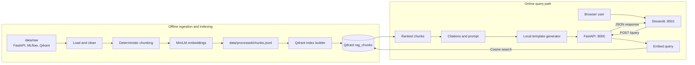

# Architecture

## Current Scope

RAGOps Control Plane currently provides a dense-retrieval RAG path over local FastAPI, MLflow, and Qdrant documentation. It has two distinct workflows:

- An offline workflow that cleans, chunks, embeds, and indexes documentation.
- An online workflow that retrieves chunks, builds citations, generates a deterministic response, and exposes the result through FastAPI and Streamlit.

Evaluation, BM25, hybrid retrieval, reranking, routing, caching, tracing, canary gates, and monitoring are planned but are not part of the current runtime.

## System Diagram

## Component Responsibilities

| Component | Location | Responsibility |
| --- | --- | --- |
| Loaders and cleaners | `src/ragops/ingestion` | Read supported local files, normalize text, and retain source provenance. |
| Chunker | `src/ragops/ingestion/chunking.py` | Create deterministic fixed, overlapping, or heading-aware chunks with UUID5 IDs and SHA256 hashes. |
| Embedder | `src/ragops/ingestion/embeddings.py` | Generate batched `sentence-transformers/all-MiniLM-L6-v2` vectors and cache the model in-process. |
| Indexer | `src/ragops/indexing/qdrant.py` | Create the `rag_chunks` collection and upsert embedded chunk records with payload metadata. |
| Dense retriever | `src/ragops/retrieval/dense.py` | Embed a query, search Qdrant, and normalize ranked results into `RetrievedChunk` objects. |
| Citations and generation | `src/ragops/generation` | Deduplicate sources, assign citation IDs, build grounded context, and call the configured generation client. |
| API | `src/ragops/app.py` | Expose health, retrieval, and query endpoints; translate errors; and close Qdrant clients. |
| Dashboard | `dashboard/app.py` | Call `POST /query` over HTTP and display the answer, citations, chunks, scores, and latency. |

## Offline Data Flow

1. `scripts/ingest.py` walks `data/raw` in stable path order.
2. Supported documentation and selected FastAPI example files are cleaned into `Document` records.
3. Documents are split into deterministic `DocumentChunk` records. The default strategy is heading-aware chunking with 250 whitespace tokens and 50 tokens of overlap.
4. Chunk text is embedded with `sentence-transformers/all-MiniLM-L6-v2`.
5. Embedded records are written as JSONL to `data/processed/chunks.jsonl`. Each record contains the chunk text, IDs, hash, metadata, and vector.
6. `scripts/build_index.py` reads the JSONL file, creates the Qdrant `rag_chunks` collection when needed, and upserts records in batches.

Raw documents and generated JSONL are intentionally ignored by Git. Their source URLs, selected paths, snapshot commits, and destination paths are recorded in `data/manifests/source_manifest.json`.

## Online Request Flow

1. Streamlit sends `query` and `top_k` to `POST /query`.
2. FastAPI validates `top_k` as an integer from 1 through 20.
3. The API resolves Qdrant from `QDRANT_URL`, defaulting to `http://localhost:6333` for a host-run API.
4. The dense retriever embeds the stripped query with the same model used during indexing.
5. Qdrant performs cosine-similarity search and returns payloads without vectors.
6. Results are normalized with 1-based ranks, scores, metadata, and the best available source path or URL.
7. Citations are deduplicated by document and section and assigned IDs such as `[1]`.
8. The generation layer builds a context-only prompt and sends it to the configured template, OpenAI, or Gemini client. The template client remains the offline default.
9. FastAPI returns the answer, structured citations, formatted citations, retrieved chunks, used chunk IDs, and total latency.
10. Streamlit renders the response. It does not connect to Qdrant or import the retrieval pipeline directly.

## Runtime Services and Configuration

| Service | Default address | Notes |
| --- | --- | --- |
| Qdrant HTTP | `http://127.0.0.1:6333` | Docker Compose exposes the Qdrant service on the host. |
| Qdrant gRPC | `127.0.0.1:6334` | Exposed but not used by the current Python path. |
| MLflow | `http://127.0.0.1:5000` | Available for later experiment tracking; not used by the current request path. |
| FastAPI | `http://127.0.0.1:8000` | Provides `/health`, `/retrieve`, `/query`, and `/docs`. |
| Streamlit | `http://localhost:8501` | Calls FastAPI using `RAGOPS_API_URL`. |

When FastAPI runs on the host, leave `QDRANT_URL` unset or set it to `http://127.0.0.1:6333`. Docker Compose overrides it with `http://qdrant:6333` for the API container. Streamlit defaults to `http://127.0.0.1:8000`; override `RAGOPS_API_URL` when the API is elsewhere.

## Error Boundaries

- Pydantic request failures, including `top_k` outside 1–20, return HTTP 422.
- Query validation failures detected by the retrieval or generation layer return HTTP 400.
- Unexpected retrieval failures return HTTP 503 from `/retrieve`.
- Unexpected retrieval or generation failures return HTTP 503 from `/query`.
- Streamlit converts connection failures and API error details into readable page messages.
- Qdrant clients are closed after both successful and failed retrieval calls.

## Current Limitations

- Answer generation remains deterministic until an OpenAI or Gemini provider and its API key are selected through environment variables.
- Only dense retrieval is implemented.
- The corpus and generated embeddings are local artifacts and are not distributed in Git.
- Ingestion and index building load the full current record set into memory.
- Source references are usually corpus-relative paths rather than public documentation URLs.
- MLflow, evaluation, tracing, routing, caching, reranking, canary gates, and monitoring are not connected yet.
