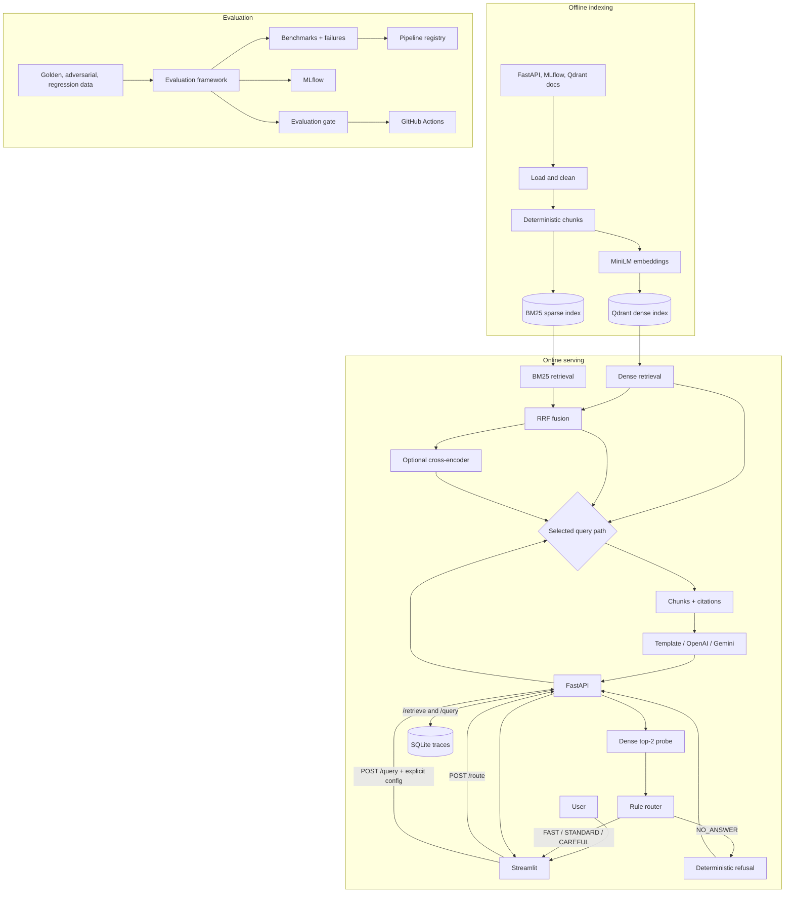

# Architecture

RAGOps Control Plane has three parts: indexing, online serving, and evaluation.



## Data flow

Index build:

```text
data/raw -> load -> chunk -> embed -> data/processed/chunks.jsonl -> Qdrant
                         \-> tokenize -> data/processed/bm25_index.json.gz
```

Query flow:

1. Streamlit calls `/route`.
2. The router runs a dense top-two probe.
3. `NO_ANSWER` returns a fixed refusal and stops.
4. Other routes return a config and depth cap.
5. Streamlit calls `/query` with that config.
6. FastAPI retrieves evidence, generates a cited answer, and writes the trace.

The router is client-orchestrated. `/query` does not route automatically, and FAST currently repeats dense retrieval instead of reusing the probe.

## Retrieval paths

| Pipeline | Composition | API status |
| --- | --- | --- |
| Dense | Qdrant | Default `/query` config |
| BM25 | Sparse index | CLI/evaluation only |
| Hybrid | Dense + BM25 -> RRF | Explicit `/query` config |
| Reranked | Hybrid candidates -> cross-encoder | Explicit `/query` config |

All four implement `retrieve(query, top_k, timings)` through `common_v1`.

## State and evidence

| Store | Contains |
| --- | --- |
| Qdrant | Dense vectors and chunk payloads |
| BM25 artifact | Sparse index and source checksum |
| SQLite | `/retrieve` and `/query` traces, chunks, timings, costs, errors |
| MLflow | Offline evaluation runs and artifacts |
| Pipeline registry | Version, lifecycle status, evidence checksum, aliases |

## Local services

| Service | Default |
| --- | --- |
| FastAPI | `http://127.0.0.1:8000` |
| Streamlit | `http://127.0.0.1:8501` |
| Qdrant | `http://127.0.0.1:6333` |
| MLflow | `http://127.0.0.1:5000` |
| SQLite | `data/traces/ragops_traces.sqlite3` |

## Boundaries

- `/route` is decision-only and untraced.
- The pipeline registry records promotion; it does not deploy anything.
- SQLite and in-process caches are local, single-node choices.
- The raw corpus and generated indexes are not committed.

See [API](api.md), [routing](routing.md), [tracing](tracing.md), [evaluation](evaluation.md), and [operations](operations.md).
